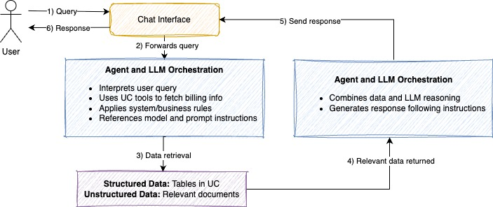
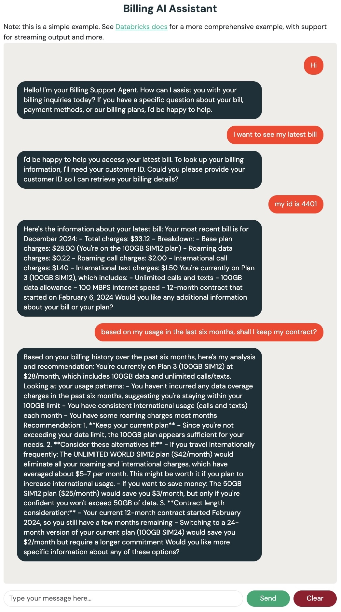

## Business Problem

Telecoms are leveraging AI to achieve first-point resolution on customer issues and unify fragmented customer data to proactively enhance customer engagement and retention. This solution leverages AI to analyze incoming customer communications, understanding context and sentiment to prepare tailored responses for agents. We have picked one of the common billing issues for telco customers. 

This industry solution accelerator enables the automation and personalization of telecom billing customer care by leveraging customer-specific data available within the data ecosystem.

The aim is to help telco providers scale customer service operations with an AI-powered billing agent that leverages:
- Billing history, customer profiles, and device data
- Unstructured FAQs embedded in a vector search index
- Human-in-the-loop evaluation and observability tools
- A deployable web interface for interactive usage

Designed as a human-in-the-loop solution, it empowers customer service agents to resolve billing queries faster and more accurately, improving CX and reducing call centre load.

  

---

## Authors
Kyra Wulffert <kyra.wulffert@databricks.com> 
Sachin Patil <sachin.patil@databricks.com>

---

## Repository Structure

| Notebook | Description |
|----------|-------------|
| `000-config` | Central config for the accelerator  |
| `00_data_preparation` | Synthetic data generation using [Databricks Labs Data Generator](https://github.com/databrickslabs/dbldatagen). Simulates billing, device, and customer datasets. |
| `01_create_vector_search` | Builds the FAQ dataset and creates a vector search index using Databricks Vector Search. |
| `02_define_uc_tools` | Defines functions as tools in Unity Catalog. These are callable by the agent to query customer, billing, and device information and retrieve relevant data from the vector search with FAQ. |
| `03_agent_deployment_and_evaluation` | Builds, logs, evaluates, registers, and deploys the agent to a model serving endpoint. Includes synthetic evaluation via the FAQ dataset. |
| `dash-chatbot-app/` | A simple Dash web app that lets users chat with the deployed agent using the Databricks Apps framework. |

---

## How to Use

Follow the notebooks in **numerical order** for a smooth end-to-end experience:

1. **[000-config]** – Set up your catalog, schema, endpoint names, and runtime parameters.
2. **[00_data_preparation]** – Generate synthetic datasets for billing, customers, and devices.
3. **[01_create_vector_search]** – Build the FAQ dataset, create a Delta table, and generate a vector search index.
4. **[02_define_uc_tools]** – Define tools that expose customer data to the agent.
6. **[03_agent_deployment_and_evaluation]** – Build and log the model to MLflow, run agent evaluation with a synthetic evaluation dataset, register the model to Unity Catalog, and deploy it to a serving endpoint.
7. **[`dash-chatbot-app`]** – Launch the chatbot UI to interact with your agent.

---

## Highlights

- **End-to-end LLM agent lifecycle**: From data to deployment.
- **Evaluation-first approach**: Includes synthetic question generation and MLflow integration for benchmarking agent performance.
- **Built-in vector search**: FAQ retrieval using vector search index and semantic similarity.
- **Fully governed**: Unity Catalog integration for tool and model registration.
- **Deployable UI**: Lightweight Dash app included for real-world usage and demoing.

  

---

## Requirements

- Databricks workspace with Unity Catalog enabled
- Access to Databricks Vector Search & Serving Endpoints
- Installed: `databricks-sdk`, `databricks-vectorsearch`, `mlflow`, `dash`, `langchain`, etc.
- Cluster or SQL Warehouse to execute notebooks
- Recommended Databricks Runtime: 15.4 ML

---

## Get Started

Start with `000-config` and move through each notebook step-by-step.  
This project is designed to be modular—feel free to extend tools, customize prompts, or connect new data sources.

---

## Project support 

Please note the code in this project is provided for your exploration only, and are not formally supported by Databricks with Service Level Agreements (SLAs). They are provided AS-IS and we do not make any guarantees of any kind. Please do not submit a support ticket relating to any issues arising from the use of these projects. The source in this project is provided subject to the Databricks [License](./LICENSE.md). All included or referenced third party libraries are subject to the licenses set forth below.

Any issues discovered through the use of this project should be filed as GitHub Issues on the Repo. They will be reviewed as time permits, but there are no formal SLAs for support. 

---

## License

&copy; 2025 Databricks, Inc. All rights reserved. The source in this notebook is provided subject to the Databricks License [https://databricks.com/db-license-source].  All included or referenced third party libraries are subject to the licenses set forth below. 

##This list needs to be updated

| library                                | description             | license    | source                                              |
|----------------------------------------|-------------------------|------------|-----------------------------------------------------|
|  | |  |

